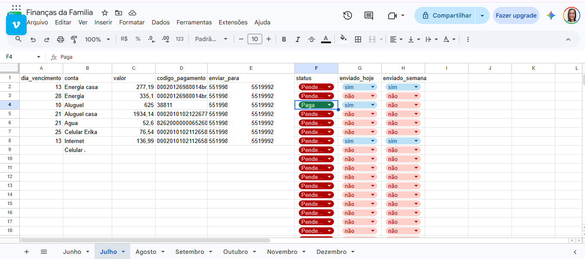
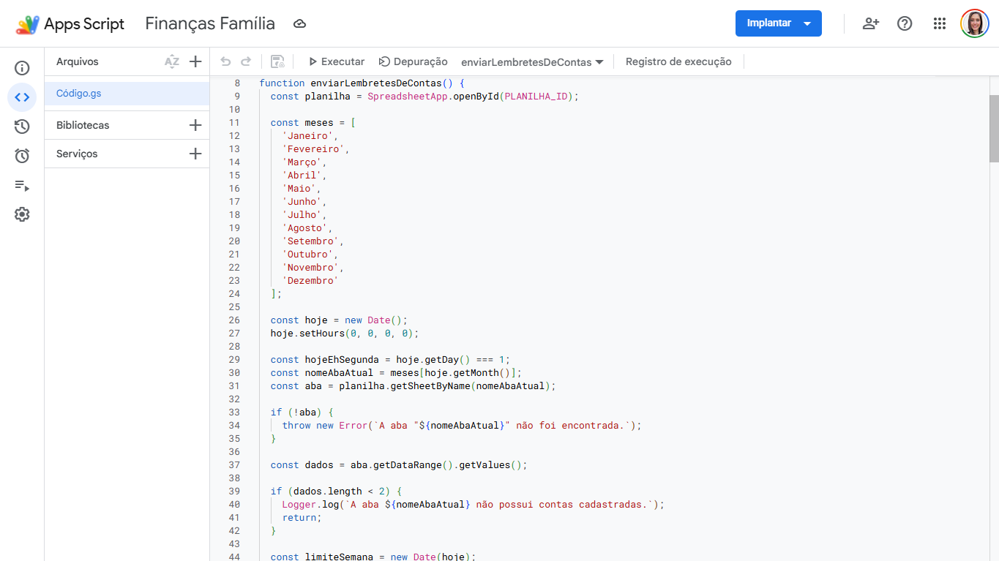
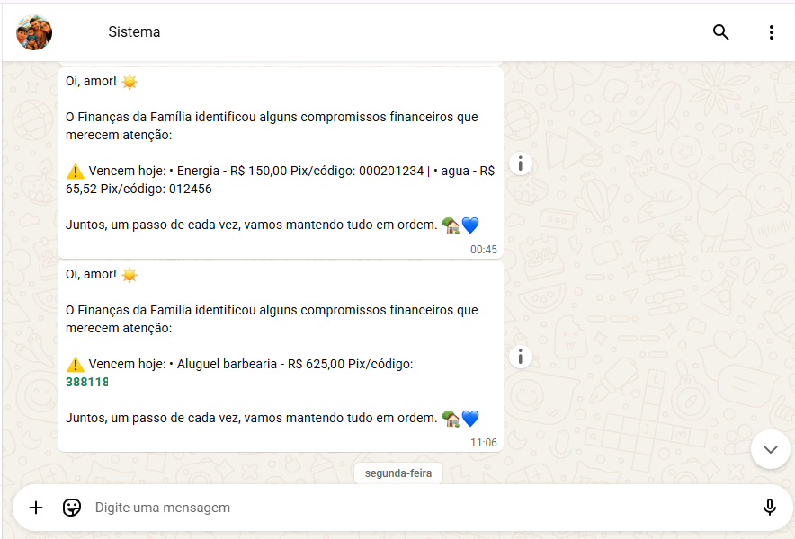

# 📲 Automação de Lembretes Financeiros via WhatsApp

Sistema desenvolvido para automatizar o envio de lembretes financeiros utilizando Google Apps Script, Google Sheets e WhatsApp Cloud API.

## Objetivo

Automatizar o processo de envio de lembretes de contas a vencer, reduzindo atividades manuais e melhorando o controle financeiro.

## Tecnologias utilizadas

- JavaScript
- Google Apps Script
- Google Sheets
- WhatsApp Cloud API
- REST API

## Funcionalidades

- Consulta automática das contas na planilha
- Envio automático de lembretes pelo WhatsApp
- Identificação de contas com vencimento no dia
- Aviso semanal de contas próximas do vencimento
- Atualização automática do status de envio

## Estrutura do projeto

```
Codigo.gs
assets/
├── whatsapp.png
├── planilha.png
└── apps-script.png
```

## Imagens

### Planilha de controle



### Código da automação



### Resultado no WhatsApp



## Autor

**Erika Gomes**

Graduanda em Sistemas para Internet.
